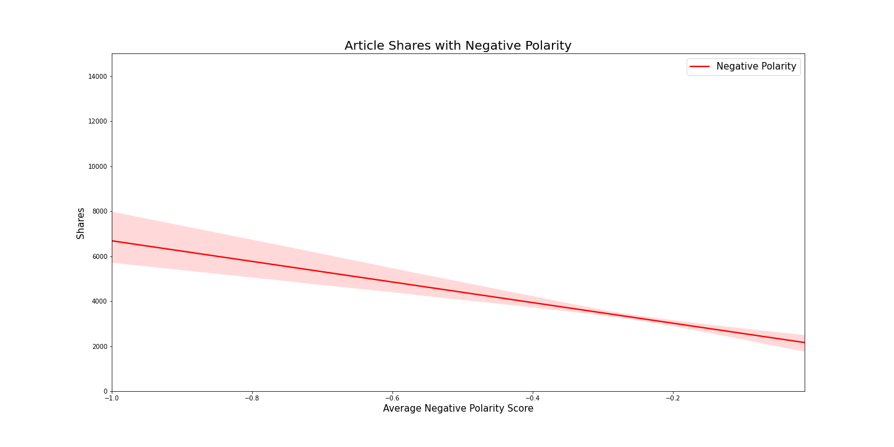

# Analyzing Online Popularity of Mashable Articles

## Abstract
The goal of the project is to understand which types of articles get more shares online and uncover trends within the Mashable data. This report analyzes articles published by Mashable in a period of two years. In this report, I have explored the themes of articles, the tone and polarity of the content behind the articles, and the publishing day to see if there is an impact on the number of shares on online media. The results highlight that Social Media and Lifestyle themed articles recieve the highest amount of shares with the World theme gaining in popularity, positive-toned articles have a better reach on online platforms, and weekends are the best publishing days for maximizing online shares.

## Data

The [dataset](http://archive.ics.uci.edu/ml/datasets/Online+News+Popularity#) contains over 60 features and over 39k rows. It is avaiable in this repository and can be used with the following citation:
 - K. Fernandes, P. Vinagre and P. Cortez. A Proactive Intelligent Decision Support System for Predicting the Popularity of Online News. Proceedings of the 17th EPIA 2015 - Portuguese Conference on Artificial Intelligence, September, Coimbra, Portugal.
 
## Research Questions
1. Does the theme of the news article affect the number of shares on an online platform? 
2. Which theme is gaining in online popularity? 
3. Is there a relationship between the polarity of the article and the number of shares it recieves?
4. Does the day an article was published impact the amount of shares it receives?

## Results Summary

